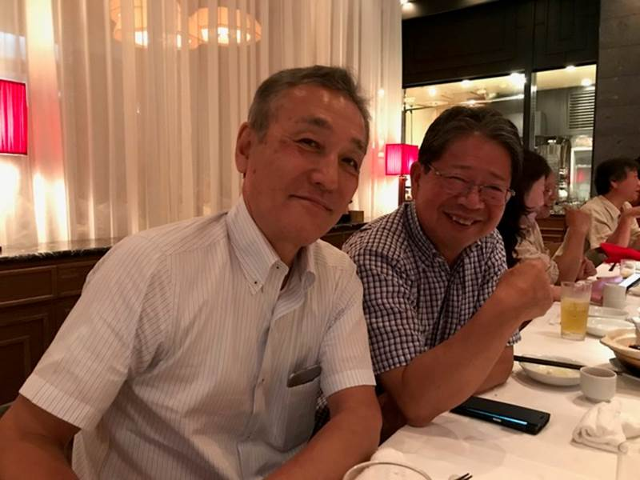
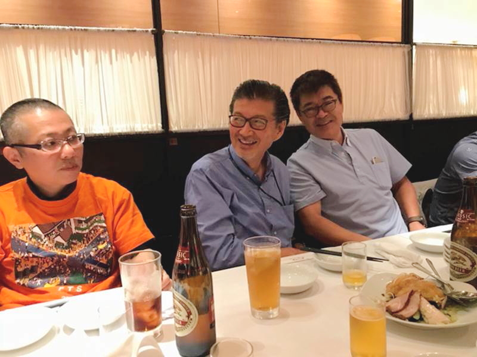
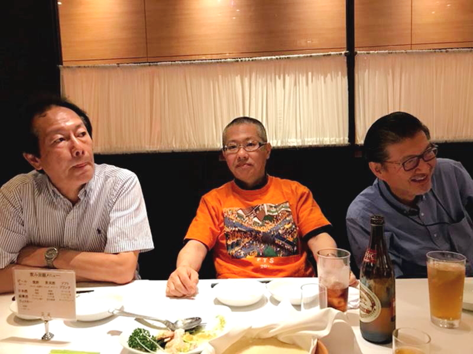
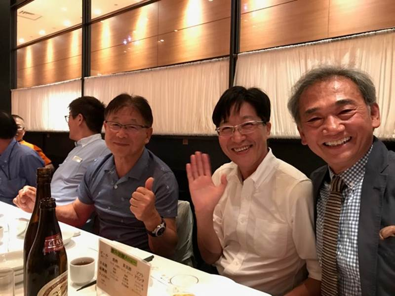
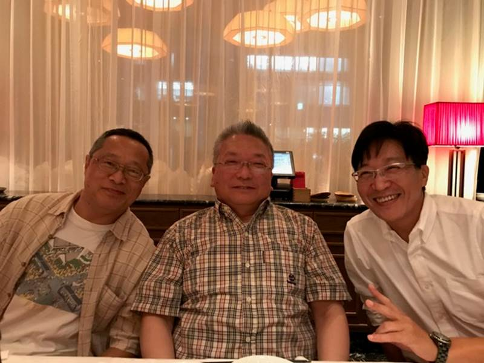
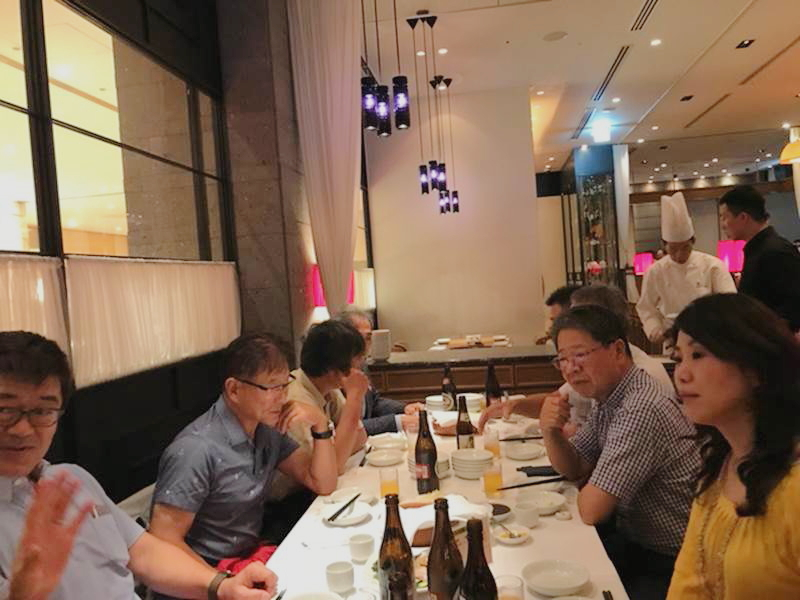
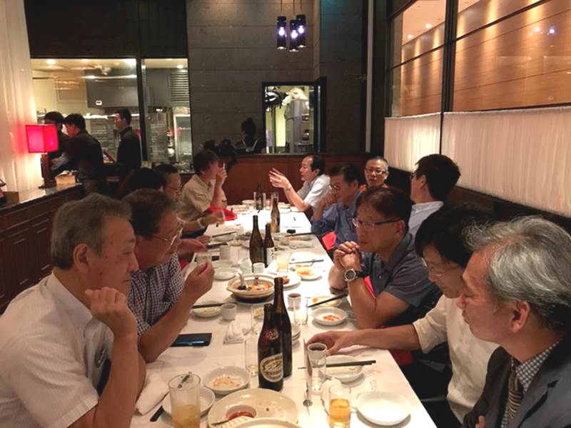
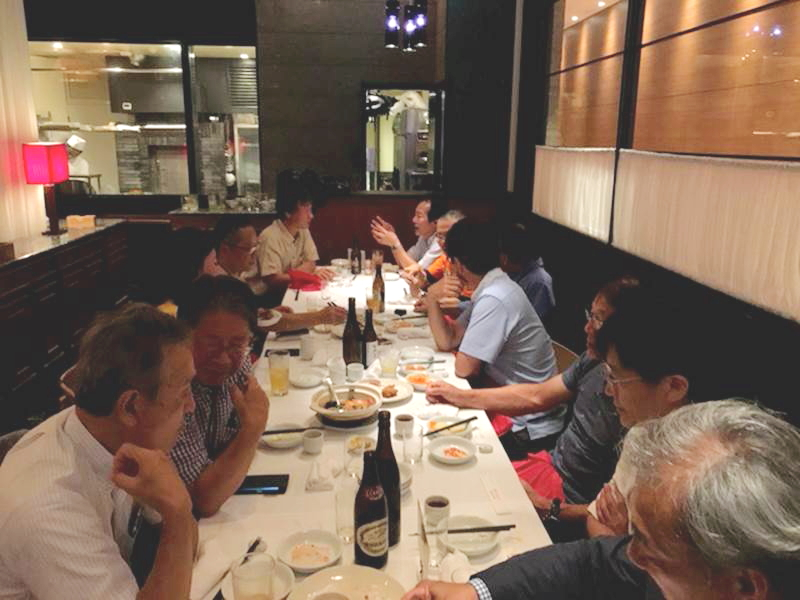
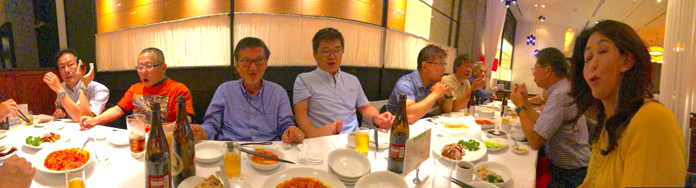

<html lang="ja">
 <head>
  <meta charset="utf-8" />

 
</head>
<body>
<h1><marquee behavior="alternate">!!! 2018年6月14日(木)にFTS同窓会が執り行われました !!!</marquee></h1>

<marquee direction="right" scrollamount="20" width="30%">(^_^)/~hada</marquee>

                             
 <ul>
	 <h3>↓画像はクリックで拡大します。閲覧後はブラウザの戻るボタンでお戻りください。</h3>
<li></li>
<li></li>
<li></li>
<li></li>
<li></li>
<li></li>
<li></li>
<li></li>
<li></li>
<li></li>
	<h3>↑パノラマ・マジックで、横山さんの手が千手観音になったり、誰だかわからない女性がいたりします。</h3>
</ul>
         
<h3>開催宣言 
★★★★★★★★★★★★★★★★★★★★★★★★★★★★★★★★★★★★★ 
From: Masayo Arai (荒井 雅代) 
Sent: Monday, June 04, 2018 2:12 PM 
To: (横山 利夫)(矢口 忠博)(加藤 秀一)(斉藤 祐司)(澁川 岳郎)(小林 実)(羽田 智) 加藤正彰さま(鎌田 豊),他 
Subject: 【人数確認】　FTS関連同窓会　 
関係者各位 
お世話様でございます。 
FTS関連の同窓会を以下の日程で行います。 
参加できる方は、このメールに6月7日（木）までにお返事くださーい。 
日時：2018年6月14日（木）19:00～ 
場所：Chinese Grill 随園別館 京橋店 
        050-3476-0232 
        https://r.gnavi.co.jp/p386002/ 
内容：コース料理を注文する予定 
予約名：荒井 
よろしくお願いいたします。 　
荒井　雅代 
株式会社 本田技術研究所　R&DセンターＸ 
★★★★★★★★★★★★★★★★★★★★★★★★★★★★★★★★★★★★★ </h3>

  </body>
</html>
  

<!-- フッタ -->
 <footer>
 Copyright 2018/06/15 S.Hada
 </footer>
